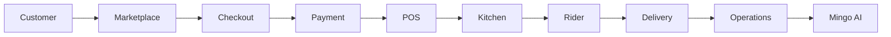
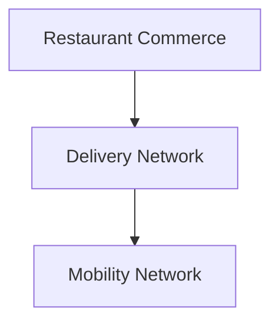
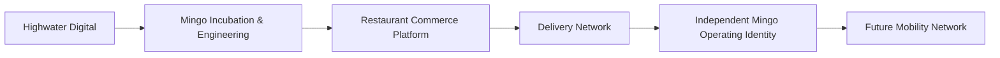

  
  
  <h1>Mingo</h1>
  
  <h3>Fair infrastructure for commerce, delivery and mobility.</h3>
  
  
Mingo connects restaurants, customers and delivery partners through a proprietary technology platform with an open-access, fair-economics network model.

 

  <table>
    <tr>
      <td align="center">
        <strong>₹10 FLAT PLATFORM FEE</strong> 
        <em>Launching model — per completed transaction</em>
      </td>
      <td align="center">
        <strong>NO PERCENTAGE MARKETPLACE COMMISSION</strong> 
        <em>Payment processing and delivery economics shown separately</em>
      </td>
    </tr>
  </table>

## Why Mingo

Modern delivery marketplaces proved the value of connected commerce infrastructure. Mingo is approaching the economics differently: **small transparent network fees** instead of large percentage marketplace commissions.

## The Mingo Principle

| RESTAURANTS WIN | RIDERS / DRIVERS WIN | CUSTOMERS WIN | MINGO WINS |
| :--- | :--- | :--- | :--- |
| Control menu economics and retain control over pricing. | Participate in transparent delivery/mobility economics. | Enjoy transparent pricing and fewer hidden fees. | Earns sustainably through network transaction scale. |

## Phase 1 — Restaurant Commerce

Mingo connects the entire restaurant transaction lifecycle through a cohesive product ecosystem:

| 🛒 Mingo Delivery | 💳 Mingo POS | 🎛️ Mingo Admin |
| :--- | :--- | :--- |
| Customer marketplace and ordering | Restaurant billing and operations | Platform command centre |

| 🍳 Mingo Kitchen | 🛵 Mingo Rider | 📊 Mingo Owner |
| :--- | :--- | :--- |
| Kitchen operations / KDS | Delivery-partner application | Owner/business visibility |

| 📱 Mingo Kiosk | 👥 Mingo People | 🤖 Mingo AI |
| :--- | :--- | :--- |
| Self-ordering | Workforce operations | Operational intelligence |

## One Connected Transaction

## Transparent Network Economics

*Illustrative network economics — not profit or forecast.*

**Example: ₹1,000 restaurant transaction**

- **Restaurant commerce value:** ₹1,000
- **Mingo platform fee:** ₹10
- **Payment processing:** Separate
- **Delivery:** Separate

**Network Scale Illustration:**
1,000 completed transactions/day × ₹10 = ₹10,000/day gross Mingo platform-fee revenue

## Phase 2 — Mobility

*Roadmap: extending the Mingo network model from delivery into local mobility.*

Restaurant delivery is the first network. The same fair-network architecture is intended to expand into local mobility.

## How Mingo Makes Money

Mingo software remains proprietary. Our commercial model is built on transparent value rather than extraction:

- Flat network/platform fees
- Managed hosting/infrastructure
- Maintenance and support
- Payment orchestration/service economics
- Enterprise integrations
- API/integration services
- Premium operational services

## Technology

- **Connected commerce platform**
- **Realtime operations**
- **Payments & POS**
- **Marketplace & Delivery**
- **Mobility-ready network architecture**
- **Operational intelligence / Mingo AI**

*Mingo Core remains authoritative for transactional and financial truth. AI assists operations rather than replacing core business authorities.*

## Our Journey

*Mingo was incubated and engineered by Highwater Digital and is now evolving into a dedicated independent platform and operating identity.*

## Build With / Partner With Mingo

We partner with:
- Restaurants
- Delivery partners
- Riders & Drivers
- Technology providers
- Payment/integration partners
- Investors

## Contact

**Website:** [https://mingodelivery.com](https://mingodelivery.com)  
**Partnerships:** [partners@mingodelivery.com](mailto:partners@mingodelivery.com)
