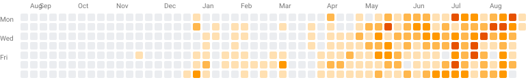

  

 

Restaurants lose margin to percentage-based marketplace commissions. Riders often face low or unpredictable delivery earnings. Customers ultimately see higher menu prices and multiple platform charges. Mingo is built to change that equation: restaurants sell without a percentage marketplace commission, riders participate in transparent delivery economics, and customers see the actual cost of commerce, payment and delivery separately. Mingo launches with a simple ₹10 flat platform fee per completed transaction. Instead of taking more when an order value increases, Mingo grows when more transactions move through the network — so restaurants, riders, customers and Mingo can all win through scale.

 

  <table>
    <tr>
      <td align="center" width="25%">
        <strong>₹10 FLAT PLATFORM FEE</strong> 
        <em>Launch model &middot; completed transaction</em>
      </td>
      <td align="center" width="25%">
        <strong>0% PERCENTAGE MARKETPLACE COMMISSION</strong> 
        <em>Restaurant commerce model</em>
      </td>
      <td align="center" width="25%">
        <strong>PAYMENT PROCESSING</strong> 
        <em>Shown separately</em>
      </td>
      <td align="center" width="25%">
        <strong>DELIVERY</strong> 
        <em>Shown separately</em>
      </td>
    </tr>
  </table>

 

## Why Mingo

<table>
  <tr>
    <td width="33%">
      <strong>RESTAURANT</strong>  
      Percentage commissions reduce margin.
    </td>
    <td width="33%">
      <strong>RIDER / DRIVER</strong>  
      Earnings can be compressed or difficult to predict.
    </td>
    <td width="33%">
      <strong>CUSTOMER</strong>  
      Platform economics can surface as higher effective prices and fees.
    </td>
  </tr>
</table>

  <strong>&darr;</strong>  
  <strong>MINGO</strong> 
  Small transparent flat network fee + separate payment + separate delivery economics

 

## The Mingo Product Ecosystem

<table>
  <tr>
    <td align="center" width="33%">
       
      <strong>MINGO DELIVERY</strong> 
      <em>Customer marketplace</em>
    </td>
    <td align="center" width="33%">
       
      <strong>MINGO POS</strong> 
      <em>Restaurant billing</em>
    </td>
    <td align="center" width="33%">
       
      <strong>MINGO KITCHEN</strong> 
      <em>Kitchen operations</em>
    </td>
  </tr>
  <tr>
    <td align="center" width="33%">
       
      <strong>MINGO RIDER</strong> 
      <em>Delivery network</em>
    </td>
    <td align="center" width="33%">
       
      <strong>MINGO OWNER</strong> 
      <em>Business visibility</em>
    </td>
    <td align="center" width="33%">
       
      <strong>MINGO PEOPLE</strong> 
      <em>Workforce</em>
    </td>
  </tr>
  <tr>
    <td align="center" width="33%">
       
      <strong>MINGO STORE</strong> 
      <em>Digital commerce</em>
    </td>
    <td align="center" width="33%">
       
      <strong>MINGO SUPPLY</strong> 
      <em>Supply operations</em>
    </td>
    <td align="center" width="33%">
       
      <strong>MINGO ADMIN / AI</strong> 
      <em>Platform intelligence</em>
    </td>
  </tr>
</table>

 

## One Connected Transaction

  <strong>CUSTOMER</strong> 
  &darr; 
  <strong>ORDER</strong> 
  &darr; 
  <strong>PAYMENT</strong> 
  &darr; 
  <strong>RESTAURANT</strong> 
  POS + KITCHEN 
  &darr; 
  <strong>RIDER</strong> 
  &darr; 
  <strong>DELIVERY</strong> 

 

  <strong>MINGO NETWORK</strong>  
  ₹10 Mingo platform fee 
  Payment processing separate 
  Delivery economics separate

 
<em>Mingo AI assists operations. Mingo Core remains the transactional and financial authority.</em>

 

## Simple economics

<strong>₹1,000 restaurant transaction</strong> 
Restaurant commerce value: <strong>₹1,000</strong> 
Mingo platform fee: <strong>₹10</strong> 
Payment processing: <em>Separate</em> 
Delivery: <em>Separate</em> 

<em>Illustrative fee-model example, not merchant settlement.</em>

 

- <strong>100 completed transactions/day</strong> = ₹1,000/day gross platform-fee revenue
- <strong>1,000/day</strong> = ₹10,000/day
- <strong>10,000/day</strong> = ₹1,00,000/day

<em>Illustrative network economics before taxes and operating costs. Not a forecast.</em>

 

## Mingo grows with transactions — not with a percentage of restaurant sales.

Mingo is designed to keep revenue per transaction small and transparent. Scale comes from increasing network participation and transaction density.

 

## ROADMAP

Restaurant commerce and delivery establish the first Mingo transaction network. The same platform principles can later extend into local mobility:

- Drivers
- Ride requests
- Dispatch
- Maps/location
- Payments
- Identity
- Operations

 

## Engineering the Mingo Network

 

### Sustained Engineering

  

**3524 GitHub contributions &middot; last 12 months**

Aggregate GitHub engineering activity from Mingo's lead platform engineering. 
Private contribution details remain anonymized by GitHub.

 

### Mingo Platform Development

From ordering and restaurant operations to marketplace, delivery and operational intelligence, each stage expanded the same transaction platform.

  

 

  

Git-verified engineering activity across Mingo's platform repositories. Duplicate histories are excluded. Core Mingo product repositories remain private.

 
<em>Mingo was engineered within Highwater Digital and is now evolving as a dedicated independent platform and operating identity.</em>

 

## Build the network with us.

We partner with restaurants, delivery partners, riders, drivers, technology providers, payment/integration partners, and investors.

**Website:** [https://mingodelivery.com](https://mingodelivery.com)  
**Partnerships:** [partners@mingodelivery.com](mailto:partners@mingodelivery.com)
