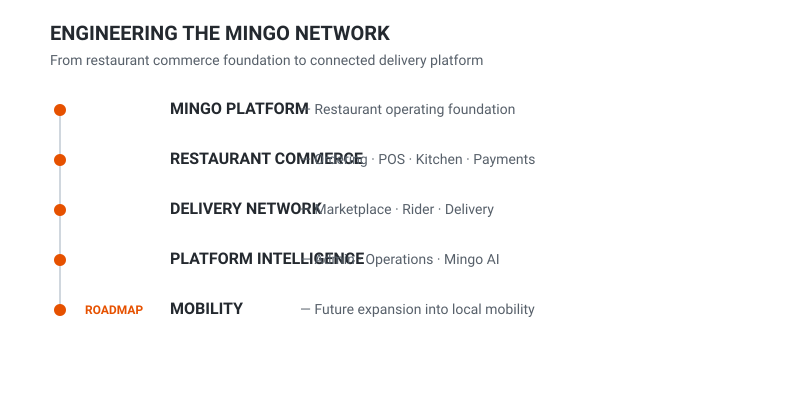

  

 

Restaurants face high marketplace commissions. Riders receive low payouts. Customers often pay inflated prices. Mingo is building a fair infrastructure platform that gives restaurants digital commerce tools, helps riders and drivers participate in better network economics, and gives customers a simpler, more transparent ordering and service experience through a flat-fee platform model.

 

  <table>
    <tr>
      <td align="center" width="33%">
        <strong>FLAT PLATFORM FEE</strong> 
        <em>Transparent network model</em>
      </td>
      <td align="center" width="33%">
        <strong>0% MARKETPLACE COMMISSION</strong> 
        <em>In the launch model</em>
      </td>
      <td align="center" width="33%">
        <strong>SEPARATE PAYMENT GATEWAY</strong> 
        <em>Clear cost separation</em>
      </td>
    </tr>
  </table>

 

## Free Platform Apps

Mingo is introducing the restaurant and delivery operating ecosystem with core apps provided free in the launch phase.

<table>
  <tr>
    <td align="center" width="33%">
       
      <strong>MINGO DELIVERY</strong> 
    </td>
    <td align="center" width="33%">
       
      <strong>MINGO POS</strong> 
    </td>
    <td align="center" width="33%">
       
      <strong>MINGO KITCHEN</strong> 
    </td>
  </tr>
  <tr>
    <td align="center" width="33%">
       
      <strong>MINGO RIDER</strong> 
    </td>
    <td align="center" width="33%">
       
      <strong>MINGO OWNER</strong> 
    </td>
    <td align="center" width="33%">
       
      <strong>MINGO PEOPLE</strong> 
    </td>
  </tr>
  <tr>
    <td align="center" width="33%">
       
      <strong>MINGO STORE</strong> 
    </td>
    <td align="center" width="33%">
       
      <strong>MINGO SUPPLY</strong> 
    </td>
    <td align="center" width="33%">
       
      <strong>MINGO ADMIN / AI</strong> 
    </td>
  </tr>
</table>

 

## Why Mingo

<table>
  <tr>
    <td width="33%">
      <strong>RESTAURANT</strong>  
      Percentage commissions reduce margin.
    </td>
    <td width="33%">
      <strong>RIDER / DRIVER</strong>  
      Earnings can be compressed or difficult to predict.
    </td>
    <td width="33%">
      <strong>CUSTOMER</strong>  
      Platform economics can surface as higher effective prices and fees.
    </td>
  </tr>
</table>

  <strong>&darr;</strong>  
  <strong>MINGO</strong> 
  Small transparent flat network fee + separate payment + separate delivery economics

 

## Engineering Journey

  

 

  

 

## Roadmap

**Phase 1**
- Restaurant commerce
- Delivery network
- Restaurant operations stack

**Phase 2**
- Mobility
- Driver network
- Local services expansion

 
<em>Mingo was engineered within Highwater Digital and is now evolving as a dedicated independent platform and operating identity.</em>

 

## Build with us

We partner with restaurants, delivery partners, riders, drivers, technology providers, payment/integration partners, and investors.

**Website:** [https://mingodelivery.com](https://mingodelivery.com)  
**Partnerships:** [partners@mingodelivery.com](mailto:partners@mingodelivery.com)
