

  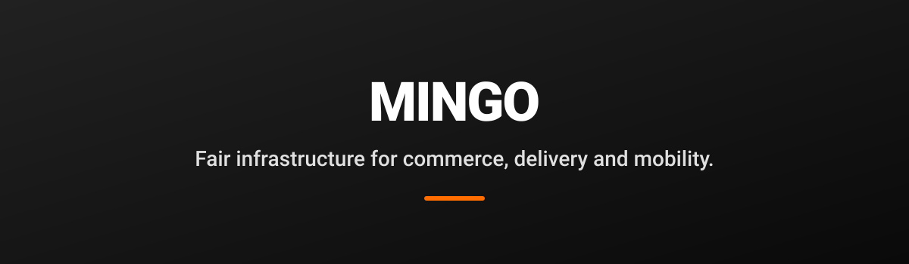

 

  
Mingo connects restaurants, customers and delivery partners through one technology platform — with transparent network economics instead of traditional percentage marketplace commissions.

 

  <table>
    <tr>
      <td align="center" width="50%">
        <strong>₹10 FLAT PLATFORM FEE</strong> 
        <em>Launch model · per completed transaction</em>
      </td>
      <td align="center" width="50%">
        <strong>NO PERCENTAGE MARKETPLACE COMMISSION</strong> 
        <em>Payment processing and delivery shown separately</em>
      </td>
    </tr>
  </table>
   
  <a href="https://mingodelivery.com">Website</a> &nbsp;&middot;&nbsp; 
  <a href="mailto:partners@mingodelivery.com">Partner with Mingo</a>

 

## The Problem

Traditional marketplace economics often scale platform charges as a percentage of transaction value. That means when the restaurant sells more, platform charges also increase.

<table>
  <tr>
    <td align="center" width="50%">
      <strong>TRADITIONAL PERCENTAGE MODEL</strong>  
      ₹1,000 order 
      ↓ 
      percentage-based marketplace charge
    </td>
    <td align="center" width="50%">
      <strong>MINGO LAUNCH MODEL</strong>  
      ₹1,000 order 
      ↓ 
      ₹10 Mingo platform fee 
      <em>(payment processing & delivery separate)</em>
    </td>
  </tr>
</table>

## A network designed to grow through transactions, not transaction extraction.

Mingo's model is designed around a small transparent network fee. Restaurants should be able to sell more without handing a growing percentage of their menu value to the technology platform. Mingo grows when more transactions flow through the network.

 

<table>
  <tr>
    <td width="25%">
      <strong>RESTAURANT</strong>  
      Control pricing and menu economics. No traditional percentage marketplace commission under the launch model.
    </td>
    <td width="25%">
      <strong>RIDER / DRIVER</strong>  
      Transparent delivery/mobility economics.
    </td>
    <td width="25%">
      <strong>CUSTOMER</strong>  
      Clear separation between commerce value, platform fee, payment and delivery.
    </td>
    <td width="25%">
      <strong>MINGO</strong>  
      Builds sustainable revenue through transaction scale and managed services.
    </td>
  </tr>
</table>

## One Platform. The Restaurant Operating Network.

<table>
  <tr>
    <td align="center" width="33%">
      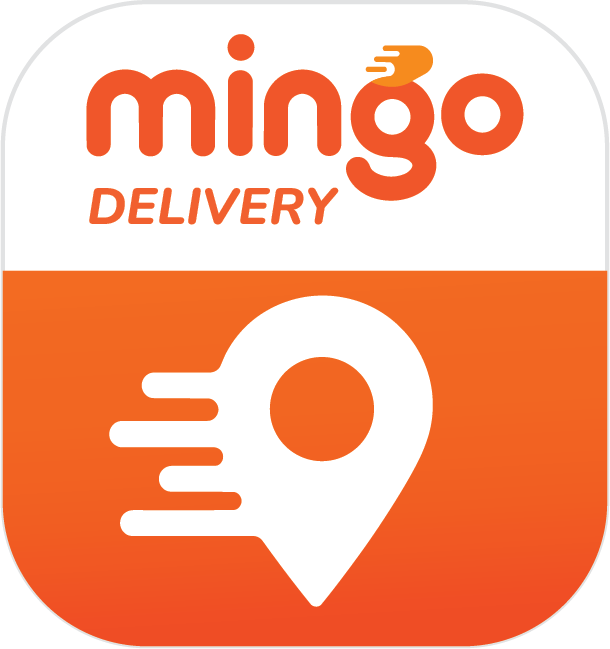 
      <strong>MINGO DELIVERY</strong> 
      <em>Customer ordering</em>
    </td>
    <td align="center" width="33%">
      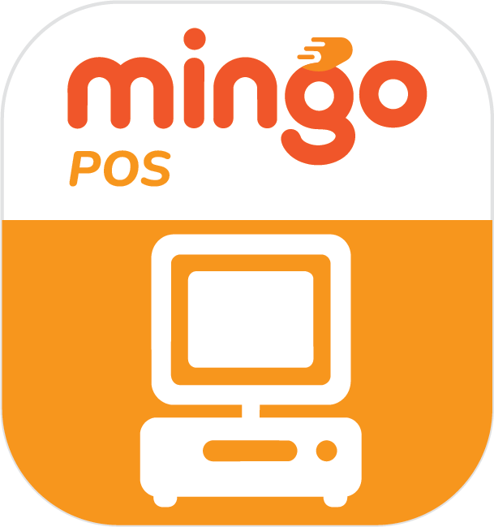 
      <strong>MINGO POS</strong> 
      <em>Restaurant billing</em>
    </td>
    <td align="center" width="33%">
      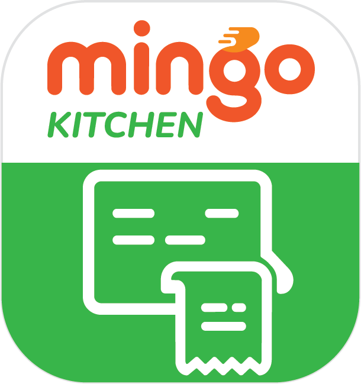 
      <strong>MINGO KITCHEN</strong> 
      <em>Kitchen execution</em>
    </td>
  </tr>
  <tr>
    <td align="center" width="33%">
      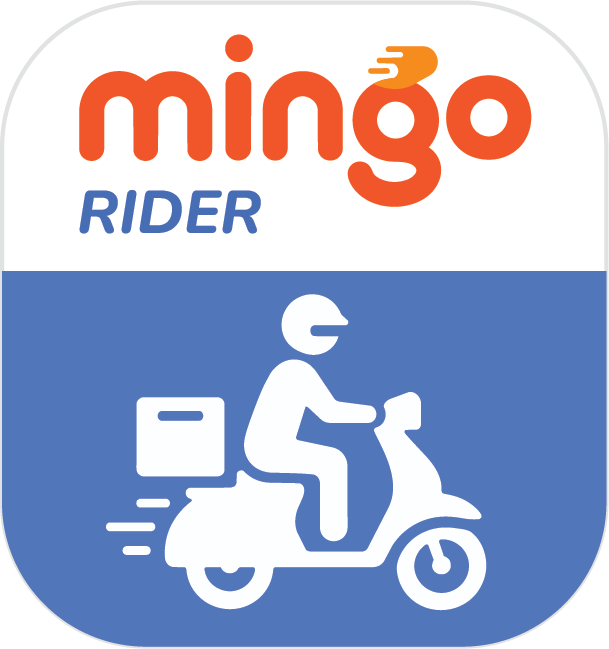 
      <strong>MINGO RIDER</strong> 
      <em>Delivery operations</em>
    </td>
    <td align="center" width="33%">
      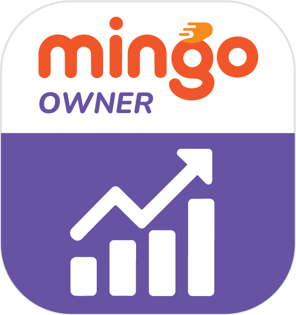 
      <strong>MINGO OWNER</strong> 
      <em>Business visibility</em>
    </td>
    <td align="center" width="33%">
      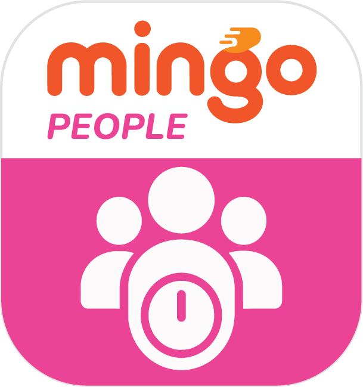 
      <strong>MINGO PEOPLE</strong> 
      <em>Workforce operations</em>
    </td>
  </tr>
  <tr>
    <td align="center" width="33%">
      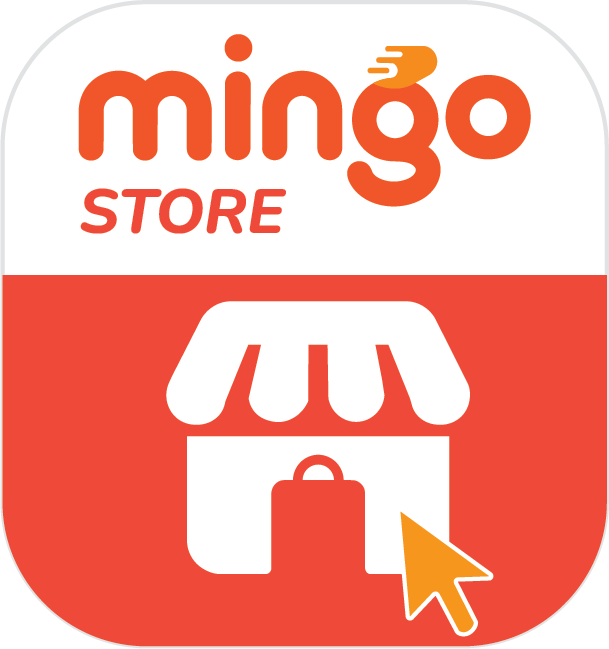 
      <strong>MINGO STORE</strong> 
      <em>Commerce storefront</em>
    </td>
    <td align="center" width="33%">
      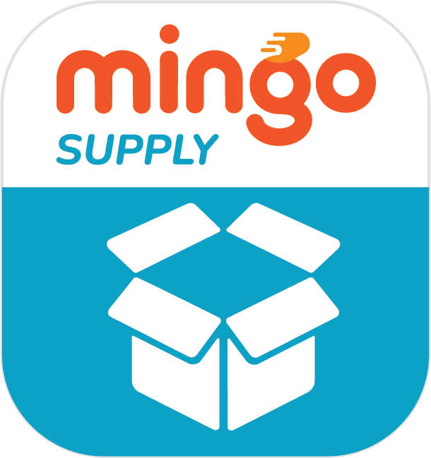 
      <strong>MINGO SUPPLY</strong> 
      <em>Supply operations</em>
    </td>
    <td align="center" width="33%">
       
      <strong>MINGO AI / ADMIN</strong> 
      <em>Intelligence & control</em>
    </td>
  </tr>
</table>

  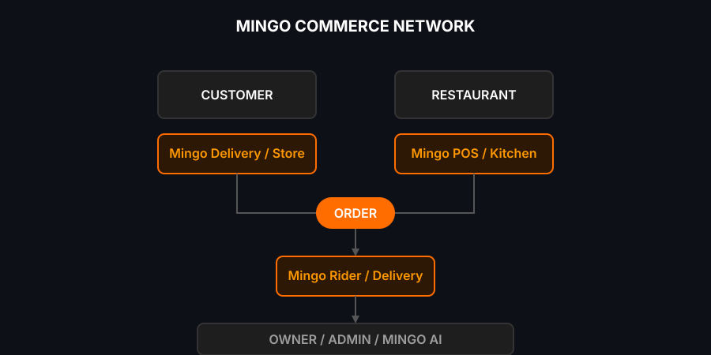

 

  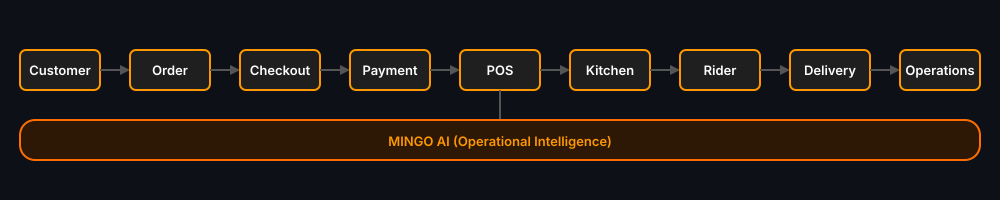

 
<em>Mingo Core remains authoritative for transactional and financial truth. Mingo AI assists operational intelligence.</em>

## Simple economics. Transparent by design.

<table>
  <tr>
    <td>
      <strong>ILLUSTRATIVE ₹1,000 RESTAURANT TRANSACTION</strong>  
      Restaurant commerce value: <strong>₹1,000</strong> 
      Mingo platform fee: <strong>₹10</strong> 
      Payment processing: <em>Separate</em> 
      Delivery: <em>Separate</em>  
      <em>Illustrative fee-model example. Not settlement, profit or investment forecast.</em>
    </td>
  </tr>
</table>

**Illustrative Network Scale:**
- **100 transactions/day** → ₹1,000/day Mingo platform-fee revenue
- **1,000 transactions/day** → ₹10,000/day
- **10,000 transactions/day** → ₹100,000/day

*Illustrative network economics — before taxes and operating costs.*

## Software enables the network. Services sustain it.

Mingo software and operating technology remain proprietary. The commercial streams that sustain the platform include:

- Flat platform/network fee
- Managed infrastructure
- Maintenance & support
- Payment orchestration/service economics
- Enterprise integrations
- API/integration services
- Premium operational services

 

  

 
<em>The same fair-network principle is intended to expand from restaurant delivery into local mobility.</em>

## Built for network density

Mingo does not need to maximize revenue on each restaurant order. The model becomes stronger as more restaurants, customers and riders transact through shared infrastructure.

**MORE RESTAURANTS + MORE CUSTOMERS + MORE RIDERS → MORE TRANSACTIONS → SUSTAINABLE NETWORK ECONOMICS**

## Technology built around the transaction

- Restaurant operations
- Marketplace commerce
- Realtime order coordination
- Payments
- Delivery operations
- Workforce and owner tools
- Operational intelligence
- Mobility-ready platform direction

*Mingo Core remains authoritative for transactional and financial truth. Mingo AI assists operations without replacing core business authorities. Core Mingo product repositories are private.*

## Engineering the Mingo Network

Mingo is being built as a connected operating platform across restaurant commerce, payments, POS, kitchen operations, delivery and operational intelligence.

  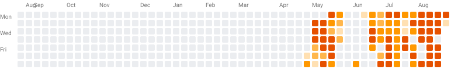

**1299 engineering commits &middot; 83 active development days &middot; last 12 months**

Aggregate engineering activity from Mingo's private development history. 
Source code and repository details remain proprietary.

 

  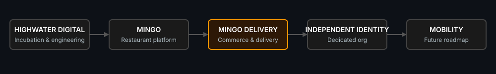

 
<em>Mingo was incubated and engineered by Highwater Digital and is now evolving into a dedicated independent platform and operating identity.</em>

## Build the network with us.

Mingo is starting with one of the most transaction-dense parts of local commerce: restaurants and delivery. The long-term direction is broader: fair infrastructure for commerce, delivery and mobility.

We partner with restaurants, delivery partners, riders, drivers, technology providers, payment/integration partners, and investors.

**Website:** [https://mingodelivery.com](https://mingodelivery.com)  
**Partnerships:** [partners@mingodelivery.com](mailto:partners@mingodelivery.com)
